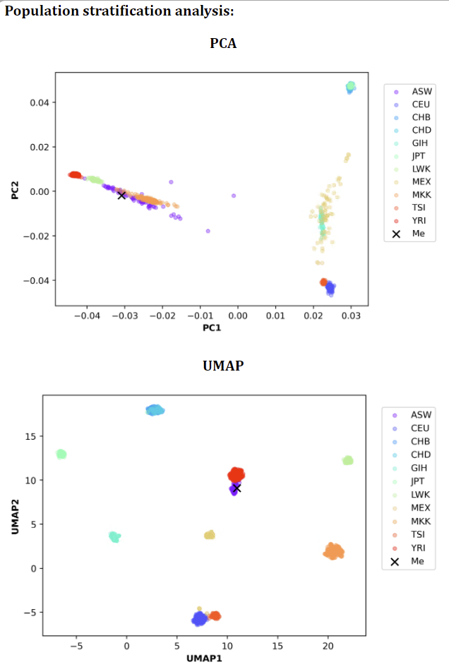
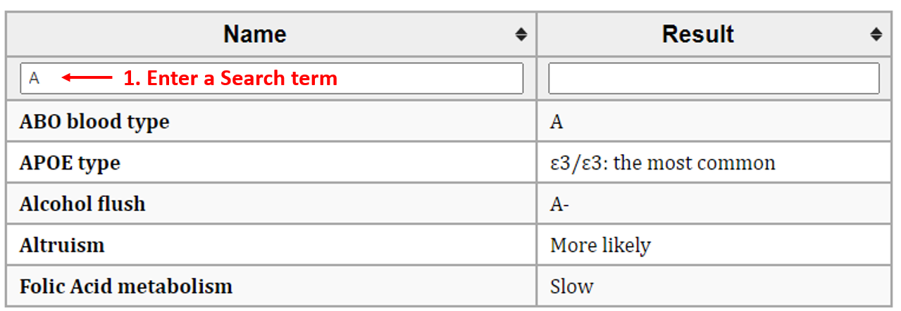
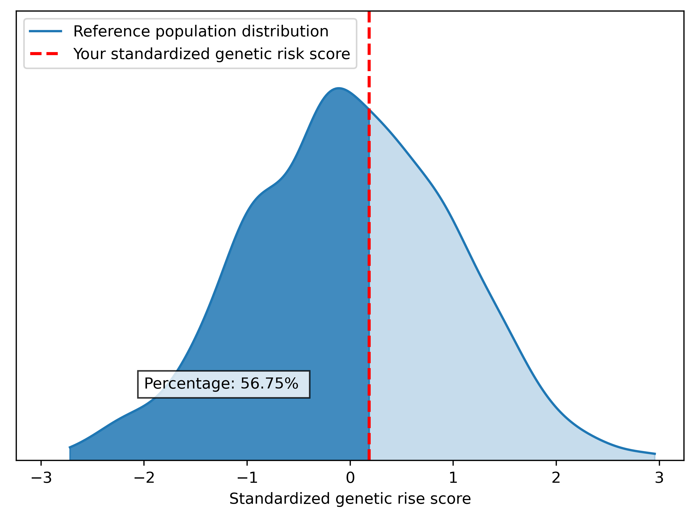
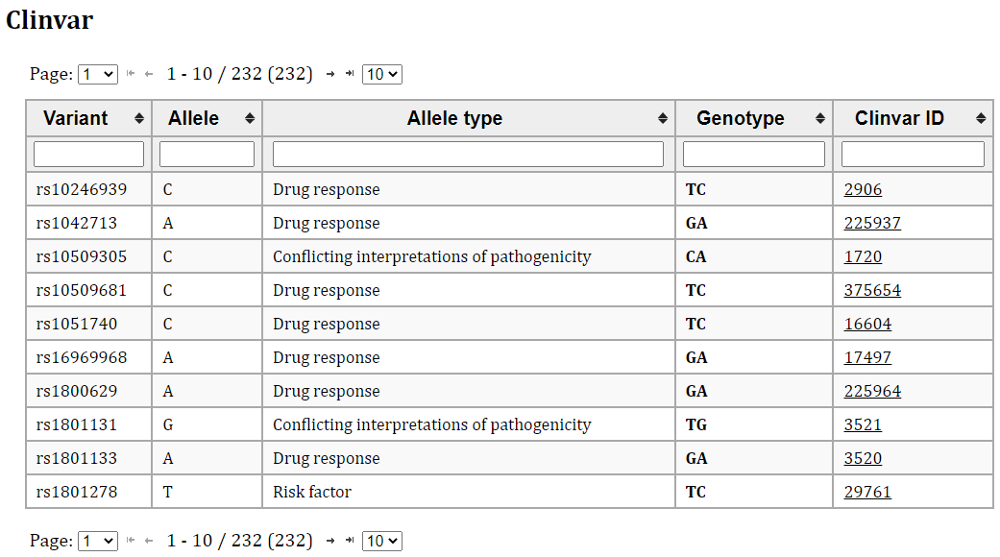

<br/>

# PAGEANT: Personal Access to Genome & Analysis of Natural Traits

<br/>

# #1. Download & Run: *for quick starter*

> ## Download:
> > - ### Download executables for [Windows](https://drive.google.com/file/d/1UiI1jwnp9ZMPYSoqn9LmZqrZVAEdLdNS/view?usp=sharing), [Linux](https://drive.google.com/file/d/1eWushdQkUEuSGQQeeRyVzzZmEM_2nq2t/view?usp=sharing), [Mac OS](https://drive.google.com/file/d/1bBJODXGjdUNtCQihRrzqDwW23KNqZ1Uv/view?usp=sharing)
> > - ### Download [HapMap3 genotype](https://www.broadinstitute.org/medical-and-population-genetics/hapmap-3), as population reference by default. LifeOver is not needed, because only SNP rsID is used by PAGEANT.
> > - ### Download [1000 genomes project (G1K) genotype](https://www.internationalgenome.org), to be used as population reference. This is only needed when the user genotype data is based on G1K imputation.

> ## Run:
> > - ### For Windows OS: the program could be run directly by double clicking "PAGEANT.exe".
> > - ### For Mac-OS: follow the instruction to install [Homebrew](https://raw.githubusercontent.com/Homebrew/install/HEAD/install.sh) and then run "[brew](https://brew.sh/) install zbar llvm", to install necessary libraries, and then double click "PAGEANT".
> > - ### For Linux: the program could be run directly by typing "./PAGEANT".

<br/>


# #2. Download & Run: *for advanced users*

> ## Prepare:
> > - ### [Conda](https://docs.conda.io/en/latest/) (or [Miniconda](https://docs.conda.io/en/latest/miniconda.html)), [Git](https://git-scm.com/), for installing python packages.
> > - ### [PLINK1.9](http://www.cog-genomics.org/plink/1.9/) and [PLINK2.0](http://www.cog-genomics.org/plink/2.0/), named "plink" and "plink2" respectively
> >		#### *set in "PATH", or in the "plink_dir" of the PAGEANT/bin/config.ini file.*
> > - ### For Mac-OS, install [Homebrew](https://raw.githubusercontent.com/Homebrew/install/HEAD/install.sh), and then run "[brew](https://brew.sh/) install zbar llvm". For Linux, run "sudo apt-get install libzbar0".

> ## Download: 
> > ```
> > git clone https://github.com/jielab/pageant.git
> > cd pageant
> > git pull # for getting an updated version
> > conda env create -f environment_linux.yml 
> > # "environment_macos.yml" for Mac-OS, "environment_win.yml" for Windows
> > ```

> ## Run:
> ### GUI version:
> > - For Windows user using Ubuntu Linux, an upgrade to Windows 11 is recommended, which supports WSL GUI.
> > - In Windows Powershell, run "wsl --update" to get the latest version.  
> > ```
> > conda activate pageant
> > python ./GUI.py
> > ```
> ### Command line version:
> > ```
> > conda activate pageant
> > python ./pageant.py -n test -i ./personal_genome/HG001.vcf.gz -o output
> > ```

<br/>


# #3. Example reports 

A full example genetic report can be viewed [here](https://htmlpreview.github.io/?https://github.com/jielab/pageant/gh-pages/Report.html) 

> ## Q1：Displayings user's PCA and UMAP among population reference

> > 

> ## Q2: Qualitative traits report

> > 

> ## Q3: Quantitative traits report

> > 

> ## Q4: Query ClinVAR database

> > 

> ## Q5: QR code to extract genetic data

> > 

<br/>


# #4. Customize
> - ### The folder structures of PAGEANT is shown below. Advanced users could also follow this structure to customize the genetic report. 
> - ### For example, under "algorithm database" folder, there are 3 files for each trait folder: TRAIT.desc.txt for description text, TRAIT.jpg for a representative picture, TRAIT.snps.ref for a list of SNPs used and the relevant calculation rules. 
> - ### The TRAIT.snps.ref is tab separated and has no header. For qualitative trait, this file has four columns: variants' name, genotype, phenotype for corresponding genotype, phenotype for non-corresponding genotype; For quantitative trait, algorithm data need three columns: variants' name, allele, effect size for corresponding allele.

> > 

<br/>


## License
> - ### This project is licensed under GNU GPL v3.

<br/>

## Contact & Cite

> - ### [Jie Huang](jiehuang001@pku.edu.cn) MD MPH PhD, Department of Global Health, Peking University School of Public Health
> - ### Manuscript under review
