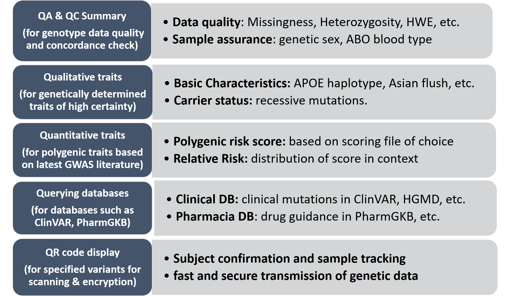
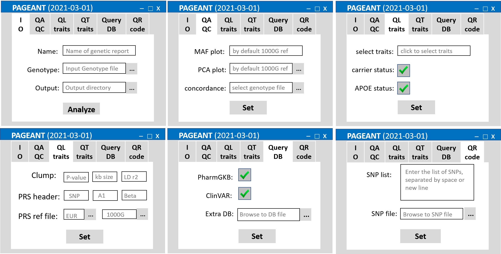
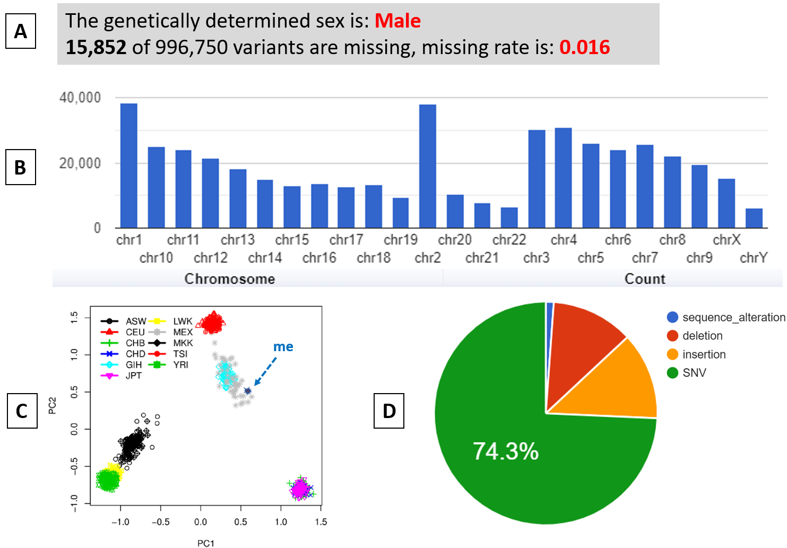
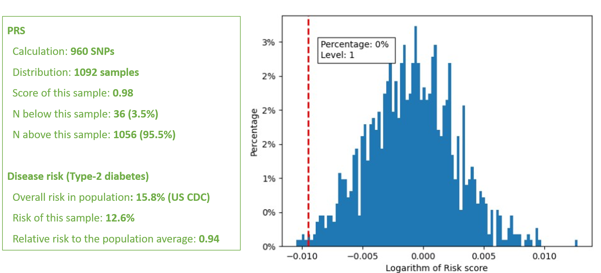
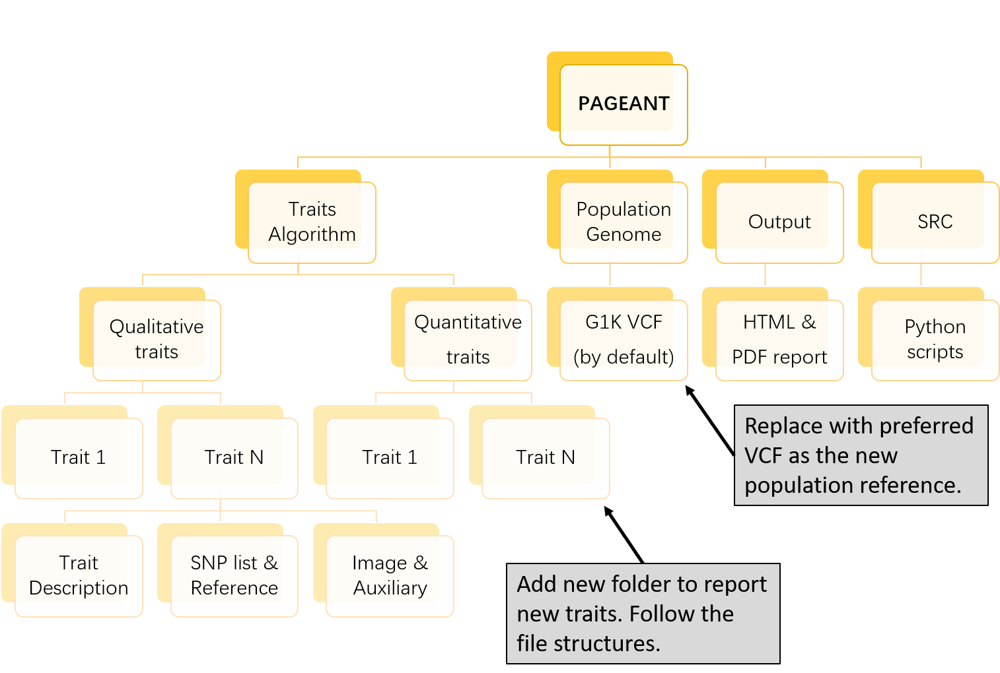

# PAGEANT: Personal Access to Genome and Analysis of Natural Traits

Contact: jiehuang001@pku.edu.cn (Jie Huang MD MPH PhD, Department of Global Health, Peking University School of Public Health)

<br />

# 1. Core functionalities (5Qs)



<br />
<br />

# 2. Install and click to run

* Three zipped folders are downloadable from [Google Drive](https://drive.google.com/drive/folders/1utGpJNofmjqoV6TG8F9FqMv9iD-CKhwi?usp=sharing) for Linux, Mac, Windows, respectively. 

* The PAGEANT.exe could be run directly by double clicking. It is compiled from GUI.py and main.py and a suite of extra libraries



<br />
<br />

# 3. Example report Q1: QA/QC of genotype data



<br />

# 4. Example report Q2 - Q4



<br />

# 5. Customize PAGEANT

## 5.1 Replace reference genome by 1000 genomes data, for example

```
start from 1000 genomes project main page https://www.internationalgenome.org. 
Then Click the "EBI FTP site" link under the "Alignments" section, and click "1000_genomes_project" link on the next page.
Users will directed to http://ftp.1000genomes.ebi.ac.uk/vol1/ftp/data_collections/1000_genomes_project/.
The "1000genomes.exome.GRCh38DH.alignment.index" file listed the FTP URL for 2,692 samples.
The New York Genome Center (NYGC) released high-coverage (30x) data for a total of 3,202 samples.
Users could download the aligned sequencing data for any set of samples from this link https://www.internationalgenome.org/data-portal/data-collection/30x-grch38, aligned to the GRCh38 reference genome. Once the CRAM file is downloaded, users could use samtools to extract certain regions of the genome to created a much smaller dataset, by using scripts such as below:

```


## 5.2 Replace PRS reference file

### 5.2.1 Download HapMap3 genotype, for calculating population risk reference

```
Open https://www.broadinstitute.org/medical-and-population-genetics/hapmap-3， 
click the 3 links under "A. SNP Genotype Data" in the section of "How To Download This Release".

Advanced users could use liftOver to convert the GRCh36 based .map file into GRCh37 based.
But this is not needed for PAGEANT, since only SNP rsID is used for querying and calculation.

```

### 5.2.2 Download G1k genotype, for calculating population risk reference
```
use wget to download files at ftp://ftp.1000genomes.ebi.ac.uk/vol1/ftp/release/20130502/

# rename the long file names to something short such as below:
mv ALL.chr1.phase3_shapeit2_mvncall_integrated_v5a.20130502.genotypes.vcf.gz chr1.vcf.gz

# rename chromosome to add "chr" prefix, if needed
seq 1 22 | xargs -n1 -I % echo % chr% > chr_name_conv.txt
bcftools annotate chr1.vcf.gz --rename-chrs chr_name_conv.txt -Oz -o chr1.vcf.gz

# convert from build 37 positions to build 38 positions, if needed
gatk --java-options "-Xmx6g" LiftoverVcf -R Homo_sapiens_assembly38.fasta.gz -I chr1.vcf.gz -O chr1.b38.vcf.gz \
	-C hg19ToHg38.over.chain --REJECT rejected.vcf --DISABLE_SORT true

# create a small VCF subset, keeping only those samples of interest.
echo "NA20525" > sample.keep
plink2 --vcf chr1.vcf.gz --extract subset.snps --keep sample.keep --export vcf bgz id-paste=iid --out chr1.subset

```


## 5.3 Add or remove report items


