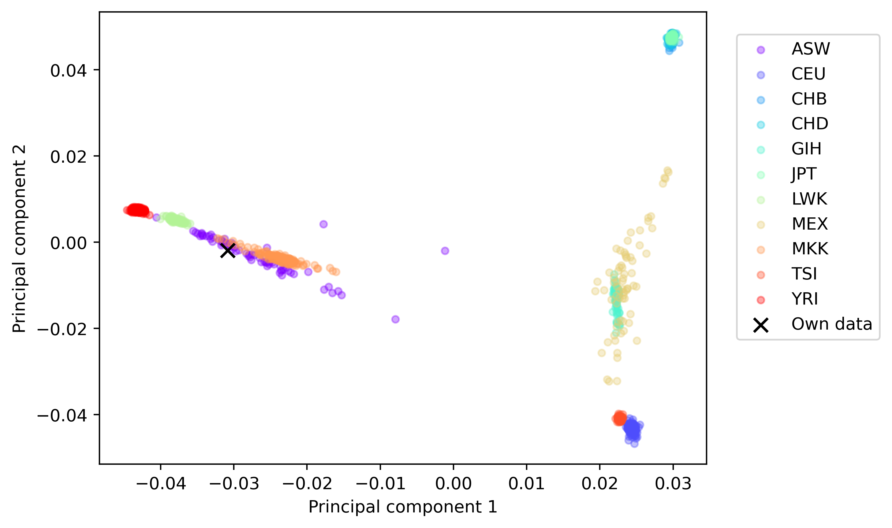
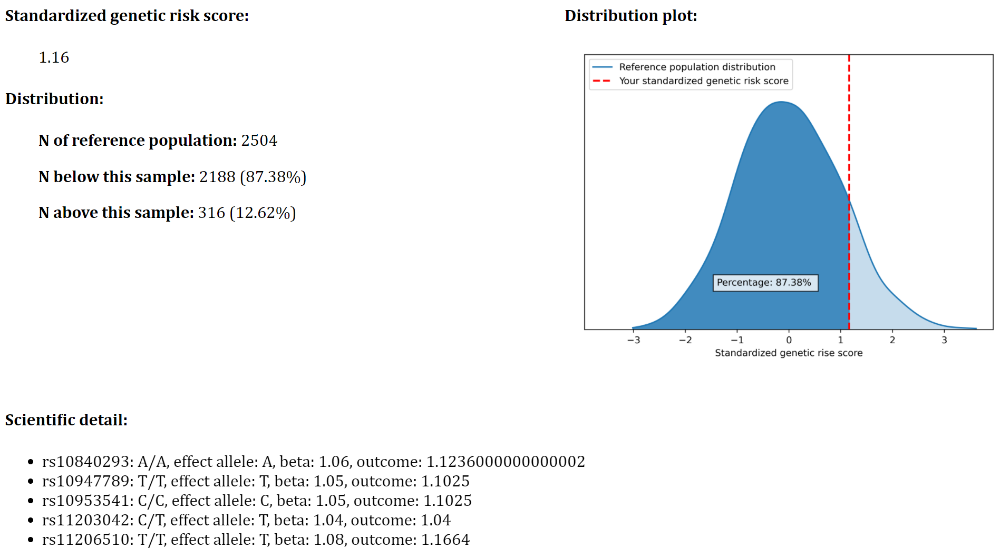
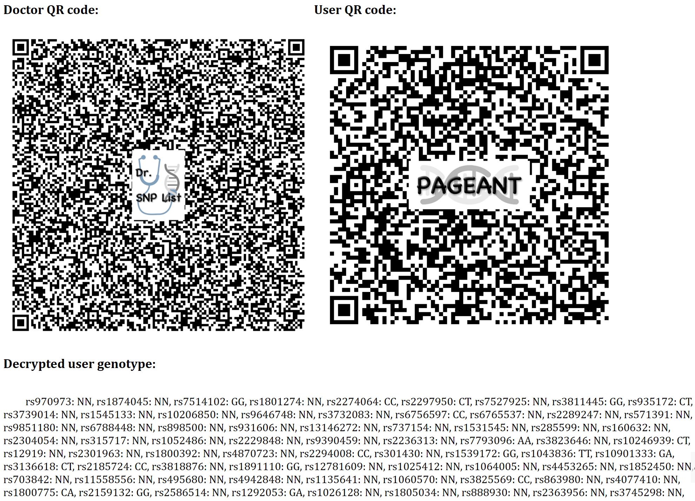
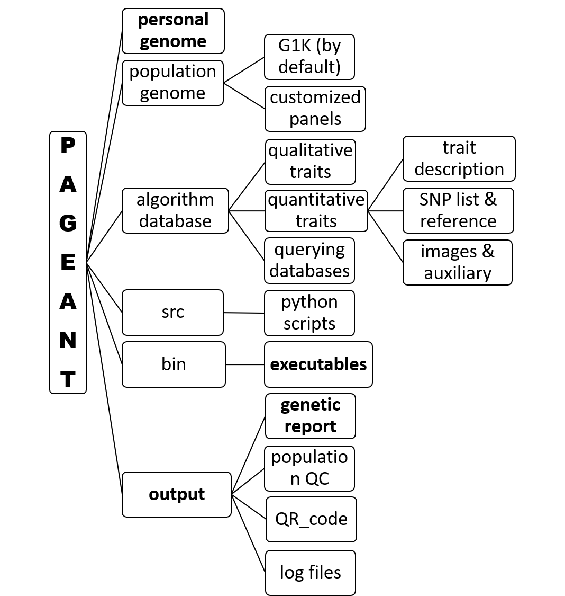

# PAGEANT: Personal Access to Genome and Analysis of Natural Traits

Contact: jiehuang001@pku.edu.cn (Jie Huang MD MPH PhD, Department of Global Health, Peking University School of Public Health)
<br />
<br />

# 1. Install and click to run

The hard core of PAGEANT is a suite of common bioinformatics software including VEP and PLINK to manage and annotate user provided genetic data. 
The main scripts include GUI.py and main.py and a suite of extra libraries. They generate user interface, manage bioinformatics processes and data flow, and eventually generate an easy-to-read report. 
<br />

Three zipped folders are downloadable from [Google Drive](https://drive.google.com/drive/folders/1utGpJNofmjqoV6TG8F9FqMv9iD-CKhwi?usp=sharing) for Linux, Mac, Windows, respectively. 
* For Windows OS, the program could be run directly by double clicking "PAGEANT.exe".
* For MAC OS, please use brew (https://brew.sh/) to run "brew install zbar" first to install necessary libraries, and then double click "PAGEANT".
* For Linux, the program could be run directly by typing "./PAGEANT".
<br />

# 2. Example report of Principal Component, as part of QA/QC


<br />
<br />

# 3. Example report of Quantitative traits


<br />
<br />

# 4. Example report of QR code


<br />
<br />

# 5. Customize PAGEANT

### 5.1 Download HapMap3 genotype, used as population reference by default

```
Open https://www.broadinstitute.org/medical-and-population-genetics/hapmap-3， 
click the 3 links under "A. SNP Genotype Data" in the section of "How To Download This Release".

Advanced users could use liftOver to convert the GRCh36 based .map file into GRCh37 based.
But this is not needed for PAGEANT, since only SNP rsID is used for querying and calculation.

```

## 5.2 Download 1000 genomes project (G1K) genotype, to be used as population reference

```

open https://www.internationalgenome.org, click "Data" menu on the top.
under "Available data" section, click "Phase 3" VCF files.

use wget to download files at ftp://ftp.1000genomes.ebi.ac.uk/vol1/ftp/release/20130502/

# rename the long file names to something short such as below:
mv ALL.chr1.phase3_shapeit2_mvncall_integrated_v5a.20130502.genotypes.vcf.gz chr1.vcf.gz

# rename chromosome to add "chr" prefix, if needed
seq 1 22 | xargs -n1 -I % echo % chr% > chr_name_conv.txt
bcftools annotate chr1.vcf.gz --rename-chrs chr_name_conv.txt -Oz -o chr1.vcf.gz

# convert from build 37 positions to build 38 positions, if needed
gatk --java-options "-Xmx6g" LiftoverVcf -R Homo_sapiens_assembly38.fasta.gz -I chr1.vcf.gz -O chr1.b38.vcf.gz \
	-C hg19ToHg38.over.chain --REJECT rejected.vcf --DISABLE_SORT true

# create a small VCF subset, keeping only those samples of interest.
echo "NA20525" > sample.keep
plink2 --vcf chr1.vcf.gz --extract subset.snps --keep sample.keep --export vcf bgz id-paste=iid --out chr1.subset

```

## 5.3 Add or remove traits from the genetic report

The folder structures of PAGEANT is shown below. Advanced users could also follow this structure to customize the genetic report. For example, under "algorithm database" folder, there are 3 files for each trait folder: TRAIT.desc.txt for description text, TRAIT.jpg for a representative picture, TRAIT.snps.ref for a list of SNPs used and the relevant calculation rules. Users could follow this structure to add many new traits to be included in the genetic report.  


