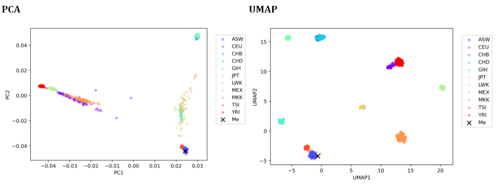
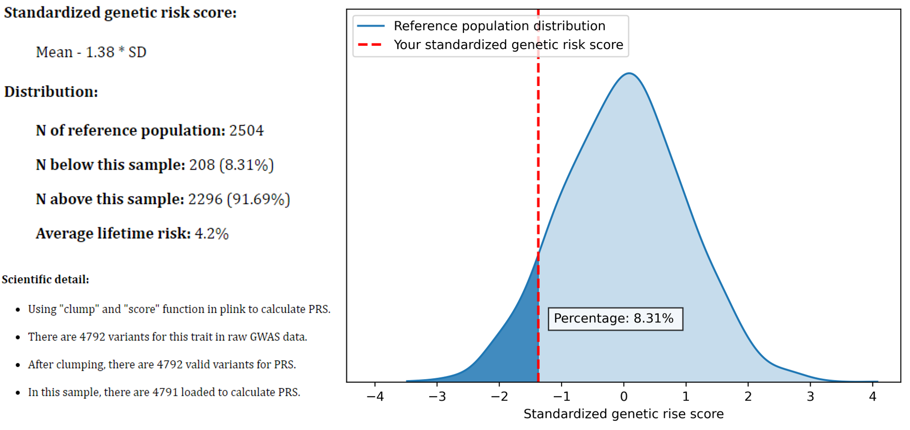
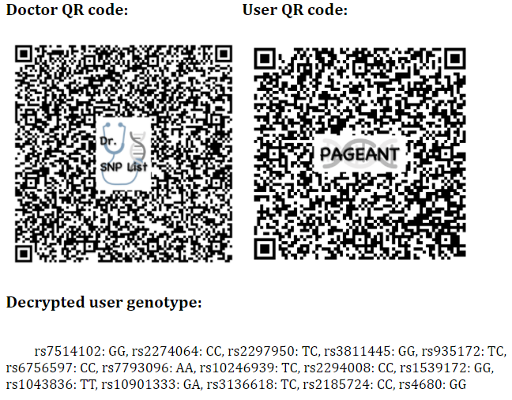

## PAGEANT: Personal Access to Genome & Analysis of Natural Traits

<br/>


## #1. The "ACGTU" Philosophy & The "5Q" Design

> ### The hard core of PAGEANT is a suite of common bioinformatics tools and python modules, combined to manage and annotate user provided genetic data. 
> ### The main scripts include GUI.py and main.py and a suite of extra libraries. They work together to generate a user interface, manage bioinformatics processes and data flow, and eventually generate an easy-to-read report. 
> ### The "ACGTU" Philosophy:
> > - #### Academic quality standard, where state-of-the-art algorithms and millions of genetic variants could be used to calculate individual Polygenic Risk Score (PRS); 
> > - #### Confidential data run locally, without the need of sending genomic data to cloud servers; 
> > - #### Generalizable architecture and algorithm, where our “five-Q” design could scale the genetic report from dozens of traits to hundreds and thousands of traits; 
> > - #### Transparent source code for all underlying programming scripts; 
> > - #### User centric, where users have the full control to add/remove certain traits into/from a genetic report. 

> ### The "5Q" Design:
> > - #### (1) Quality assurance and control report of genetic data itself; 
> > - #### (2) Qualitative assessment for genetic characteristics with absolute or relatively high certainty; 
> > - #### (3) Quantitative assessment of health risk susceptibility based on PRS and population reference; 
> > - #### (4) Query of third-party variants databases such as ClinVAR and PharmGKB; 
> > - #### (5) QR code display of genetic variants of interest, such as those variants for genetic identification and for certain drug prescription.

<br/>


## #2. Install & Run
###Requirement
> - [Git](https://git-scm.com/)
> <br><br/>
> - [PLINK1.9](http://www.cog-genomics.org/plink/1.9/) and [PLINK2.0](http://www.cog-genomics.org/plink/2.0/)**
Make sure the plink and plink2 can be found in your "PATH" enironment variable. Or you can edit the "plink_dir" settings in the "./bin/config.ini" to help PAGEANT to find the PLINK softwares(plink and plink2).
> <br><br/>
> - [Conda](https://docs.conda.io/en/latest/) or [Miniconda](https://docs.conda.io/en/latest/miniconda.html)**
Conda is a package and environment management system that allows you to install Python and other software into controlled environments without disrupting other software you have installed.
> <br><br/>
> - [Homebrew](https://brew.sh/) (For mac)
> <br><br/>
> - Reference data:
> >- Download [HapMap3 genotype](https://www.broadinstitute.org/medical-and-population-genetics/hapmap-3), as population reference by default. LifeOver is not needed, because only SNP rsID is used by PAGEANT.
> >- Download [1000 genomes project (G1K) genotype](https://www.internationalgenome.org), to be used as population reference. This is only needed when the user genotype data is based on G1K imputation.
###Installation

> In order to download `PAGEANT`, you should clone this repository via the command
> ```
> git clone https://github.com/jielab/pageant.git
> cd pageant
> ```
> For different operation system, run the corresponding command to create the environment for `PAGEANT`
> - Windows: 
>> ```
>> conda env create -f environment_win.yml
>> ```

> - Linux: 
>> ```
>> sudo apt-get install libzbar0
>> conda env create -f environment_linux.yml
>> ```

> - macOS:
>> ```
>> brew install zbar llvm
>> conda env create -f environment_macos.yml
>> ```

###Run

> **GUI version:**
> ```
> conda activate pageant
> python ./GUI.py
> ```
> **Command line version:**
> ```
> conda activate pageant
> python ./pageant.py -h
> ```
###Updating PAGEANT
> You can update to the newest version of `PAGEANT` using git. First, navigate to your pageant/ directory, then run
> ```
> git pull
> ```

###Support
> Some bugs might have been reported and solved in the latest version of `PAGEANT`. Therefore, please make sure your `PAGEANT` has been updated to the latest version.
<br><br/>
> If you are unfamiliar with the above operations, you can download the executable file from [Google Drive](https://drive.google.com/drive/folders/1utGpJNofmjqoV6TG8F9FqMv9iD-CKhwi?usp=sharing). The executable file could be run directly. It is compiled from GUI.py and pageant.py and a suite of extra libraries.
<br><br/>
> If you have any problem on installation or running, you can post the question in the "**Issues**".

<br/>


## #3. Example reports 

> ## QA/QC using principal components



> ## Quantitative traits



> ## QR code



<br/>


## #4. Customize

> - ### The folder structures of PAGEANT is shown below. Advanced users could also follow this structure to customize the genetic report. 
> - ### For example, under "algorithm database" folder, there are 3 files for each trait folder: TRAIT.desc.txt for description text, TRAIT.jpg for a representative picture, TRAIT.snps.ref for a list of SNPs used and the relevant calculation rules. 
> - ### Users could follow this structure to add many new traits to be included in the genetic report.  


<br/>


## License
> - ### This project is licensed under GNU GPL v3.

<br/>

## Contact & Cite

> - ### [Jie Huang](jiehuang001@pku.edu.cn) MD MPH PhD, Department of Global Health, Peking University School of Public Health
> - ### Manuscript under review

>>>>>>> 3cc07b00759a0d553fac887c823437d0cfe34e08
=======

## PAGEANT: Personal Access to Genome & Analysis of Natural Traits

<br/>


## #1. The "ACGTU" Philosophy & The "5Q" Design

> ### The hard core of PAGEANT is a suite of common bioinformatics tools and python modules, combined to manage and annotate user provided genetic data. 
> ### The main scripts include GUI.py and main.py and a suite of extra libraries. They work together to generate a user interface, manage bioinformatics processes and data flow, and eventually generate an easy-to-read report. 
> ### The "ACGTU" Philosophy:
> > - #### Academic quality standard, where state-of-the-art algorithms and millions of genetic variants could be used to calculate individual Polygenic Risk Score (PRS); 
> > - #### Confidential data run locally, without the need of sending genomic data to cloud servers; 
> > - #### Generalizable architecture and algorithm, where our “five-Q” design could scale the genetic report from dozens of traits to hundreds and thousands of traits; 
> > - #### Transparent source code for all underlying programming scripts; 
> > - #### User centric, where users have the full control to add/remove certain traits into/from a genetic report. 

> ### The "5Q" Design:
> > - #### (1) Quality assurance and control report of genetic data itself; 
> > - #### (2) Qualitative assessment for genetic characteristics with absolute or relatively high certainty; 
> > - #### (3) Quantitative assessment of health risk susceptibility based on PRS and population reference; 
> > - #### (4) Query of third-party variants databases such as ClinVAR and PharmGKB; 
> > - #### (5) QR code display of genetic variants of interest, such as those variants for genetic identification and for certain drug prescription.

<br/>


## #2. Install & Run
> ## Download:
> > - ### Download executables for [Windows](https://drive.google.com/file/d/147zOn5b9dqeojVbGJq_rbLKZw24NSKe_/view?usp=sharing), [Linux](https://drive.google.com/file/d/1_WUJwMuf7EAsAyW6Q4hfHeB8eE2LjLrH/view?usp=sharing), [Mac OS](https://drive.google.com/file/d/1njO2AKC8Z6PcwN1Zh6s6sVN9NUi32gfc/view?usp=sharing)
> > - ### Download [HapMap3 genotype](https://www.broadinstitute.org/medical-and-population-genetics/hapmap-3), as population reference by default. LifeOver is not needed, because only SNP rsID is used by PAGEANT.
> > - ### Download [1000 genomes project (G1K) genotype](https://www.internationalgenome.org), to be used as population reference. This is only needed when the user genotype data is based on G1K imputation.
> ## Run:
> > - ### For Windows OS: the program could be run directly by double clicking "PAGEANT.exe".
> > - ### For Mac-OS:  fullow the instruction to install [Homebrew](https://raw.githubusercontent.com/Homebrew/install/HEAD/install.sh) and then run "[brew](https://brew.sh/) install zbar" first, to install necessary libraries, and then double click "PAGEANT".
> > - ### For Linux: the program could be run directly by typing "./PAGEANT".

<br/>


## #3. Example reports 

> ## QA/QC using principal components


> ## Quantitative traits


> ## QR code


<br/>


## #4. Customize

> - ### The folder structures of PAGEANT is shown below. Advanced users could also follow this structure to customize the genetic report. 
> - ### For example, under "algorithm database" folder, there are 3 files for each trait folder: TRAIT.desc.txt for description text, TRAIT.jpg for a representative picture, TRAIT.snps.ref for a list of SNPs used and the relevant calculation rules. 
> - ### Users could follow this structure to add many new traits to be included in the genetic report.  


<br/>


## License
> - ### This project is licensed under GNU GPL v3.

<br/>

## Contact & Cite

> - ### [Jie Huang](jiehuang001@pku.edu.cn) MD MPH PhD, Department of Global Health, Peking University School of Public Health
> - ### Manuscript under review

>>>>>>> 3cc07b00759a0d553fac887c823437d0cfe34e08
