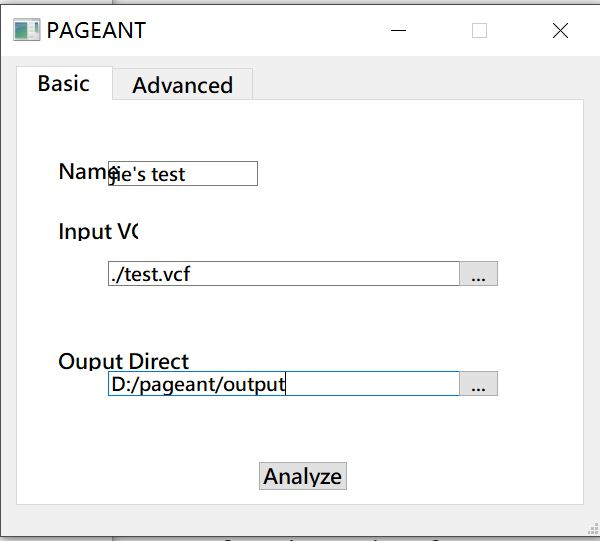
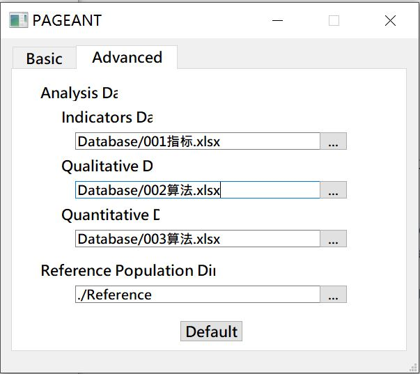
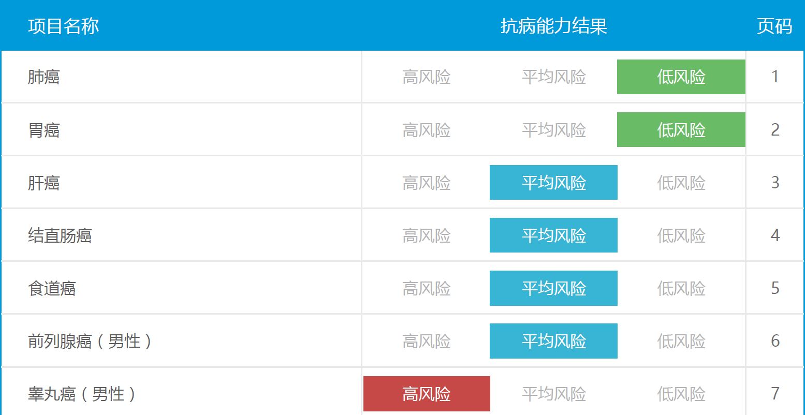
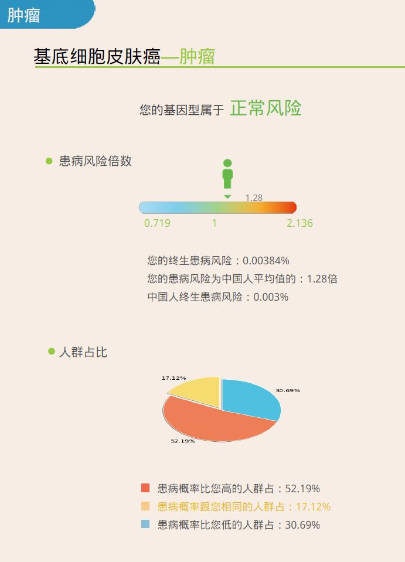

# PAGEANT: Personal Analysis of Genome and Annotation Toolkit
# DTC genome report, free, reliable, and DIY.
PAGEANT differs from other similar tools, summarized by “A-C-G-T”: 
(1). Academic quality standard, where start-of-the-art algorithms and millions of genetic variants could be used to calculate PRS; 
(2). Confidential data run locally, no need to send genomic data to cloud servers; 
(3). Generalizable health assessment, easy to add/remove scope of health reports based on users' preference and comfort level. 
(4). Transparent source code for all underlying programming scripts..


Author: Zhisheng Liang MS, Jie Huang MD PhD, Department of Global Health, Peking University School of Public Health


# #1 Download and Install

**#1.1 download the source code and executable

```
Create a dedicated diretory and then type the following command to download the full package of PAGEANT 
git clone https://github.com/jielab/pageant.git

The PAGEANT.exe could be run directly by double clicking. It is compiled from GUI.py and main.py and a suite of extra libraries

```

**#1.2 download HapMap3 reference genome for calculating population risk reference

```
Open https://www.broadinstitute.org/medical-and-population-genetics/hapmap-3， 
click the 3 links under "A. SNP Genotype Data" in the section of "How To Download This Release".

Advanced users could use liftOver to convert the GRCh36 based .map file into GRCh37 based.
But this is not needed for PAGEANT, since only SNP rsID is used for querying and calculation.

```

**#1.3 run from the GUI interface





# #2 Examine the report





# #3 Customize PAGEANT

**#3.1. Replace reference genome by 1000 genomes data, for example

```
start from 1000 genomes project main page https://www.internationalgenome.org. 
Then Click the "EBI FTP site" link under the "Alignments" section, and click "1000_genomes_project" link on the next page.
Users will directed to http://ftp.1000genomes.ebi.ac.uk/vol1/ftp/data_collections/1000_genomes_project/. 
The "1000genomes.exome.GRCh38DH.alignment.index" file listed the FTP URL for 2,692 samples. 
The New York Genome Center (NYGC) released high-coverage (30x) data for a total of 3,202 samples. 
Users could download the aligned sequencing data for any set of samples from this link https://www.internationalgenome.org/data-portal/data-collection/30x-grch38, aligned to the GRCh38 reference genome. Once the CRAM file is downloaded, users could use samtools to extract certain regions of the genome to created a much smaller dataset, by using scripts such as below:

```


**#3.2. Replace PRS reference file


**#3.3. Choose different PRS calculation methods


**#3.4. Add or remove report items


