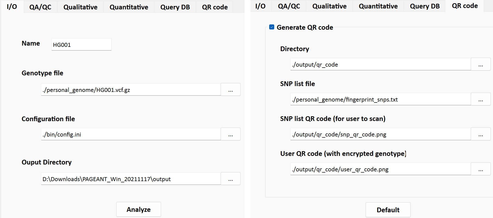
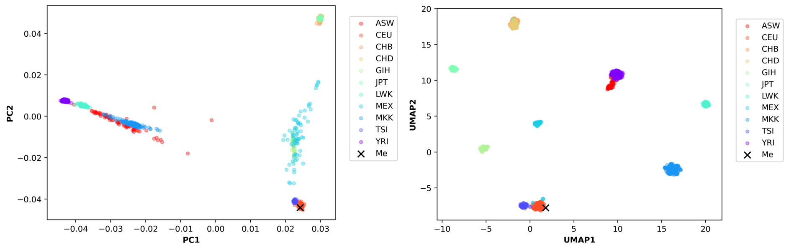

 

## PAGEANT: Personal Access to Genome & Analysis of Natural Traits

 

## 1. Download & Run

> 1. Download executables for [Windows](https://drive.google.com/file/d/1Y6qy63MnaHCwDsshUThCfyUp6a0ZZVXZ/view?usp=sharing), [Linux](https://drive.google.com/file/d/1zvgbGQJfpPJK3mL748cYrv83HgryEo-x/view?usp=sharing), [Mac OS](https://drive.google.com/file/d/1pj5CzZJwobT7IX_HS7KGPNp0_hFkqaNS/view?usp=sharing)
> 2. For Windows OS: the program could be run directly by double clicking "PAGEANT.exe".
> 3. For Mac-OS: follow the instruction to install [Homebrew](https://raw.githubusercontent.com/Homebrew/install/HEAD/install.sh) and then run "[brew](https://brew.sh/) install zbar llvm", to install necessary libraries, and then double click "PAGEANT".
> - For Linux: run "sudo apt-get install libzbar0 python3-pyqt5" to install packages, then run PAGEANT by typing "./PAGEANT".
> - For advanced users, please check out the wiki for command line approaches.
 

## 2. Example test-run 

> Once the GUI window is displayed, a user simply needs to click the “Analyze” button to do a “test-drive” without doing anything else.
> Once a user gets familiar with the test-drive, he/she could change all parameters in the GUI interface:
> > - sample name
> > - genotype data (in VCF format)
> > - configuration file
> > - output location for the genetic report and log file

 

## 3. Example report 

> - #### A full example genetic report can be viewed [here](https://pageant.me/Report.html). 

> - #### Q1：Displayings user's PCA and UMAP among population reference

> 

> - #### Q2: Qualitative traits report

> 

> - #### Q3: Quantitative traits reportaa

> 

> - #### Q4: Query ClinVAR database

> 

> - #### Q5: QR code to extract genetic data

> 

 

### Contact & Cite

> - [Jie Huang](jiehuang001@pku.edu.cn) MD MPH PhD, Southern University of Science and Technology
> - Jie Huang, Zhi-Sheng Liang, Stefano Pallotti, Janice M. Ranson, David J. Llewellyn, Zhi-Jie Zheng, Dan A. King, Qiang Zhou, Houfeng Zheng, Valerio Napolioni. PAGEANT: personal access to genome and analysis of natural traits. [Nucleic Acids Res. 2022 Apr 22;50(7):e39. ](https://pubmed.ncbi.nlm.nih.gov/34928375/)
